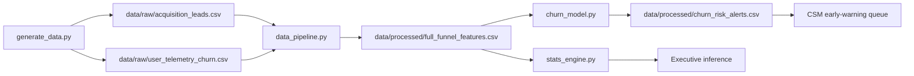

# Full-Funnel SaaS Retention & Churn Prediction Engine (LTV:CAC Optimizer)

A production-style analytics system for B2B SaaS: **buy the right customers at the Front Door, and stop losing them at the Back Door.**

This repository is designed as a senior data-science / analytics-engineering portfolio piece. It follows the Google Advanced Data Analytics stack — pandas, inferential statistics, scikit-learn, and gradient boosting — with an explicit contract between **acquisition economics** and **product-led retention**.

---

## Executive Overview

Most churn models start too late. They score usage after the company has already paid CAC, then ask Customer Success to “save” accounts that were never a fit.

This engine treats retention as a **two-door system**:

| Door | Business question | Data | Decision |
| --- | --- | --- | --- |
| **Front Door (Acquisition)** | Are we paying for customers who can become profitable? | Channel, sales cycle, CAC, MRR, contract term | Reallocate spend toward high LTV:CAC, low-churn mix |
| **Back Door (Retention)** | Are engaged customers slipping into silence? | Logins, feature adoption, support load, inactivity | Score active accounts and trigger CS interventions |

Synthetic but realistic extracts (`n = 5,000`) are generated with a **logistic churn process**: inactivity, weak feature adoption, monthly contracts, and outbound-heavy mix raise the log-odds of churn. The downstream pipeline does not “know” that formula — it has to recover it with hypothesis tests and supervised models.

**Headline result on the seeded book of business (seed = 42):** overall churn is **12.9%**. That rate is not uniform. Partner Referral churns at **3.2%**; Outbound Cold Email churns at **24.1%**. Feature adoption is **~2.1 points lower** among churned accounts (Cohen’s *d* = **−1.06**, large). The operating implication is blunt: onboarding friction and channel quality are first-order P&L levers, not dashboard vanity metrics.

---

## Architecture



```
src/generate_data.py      Front Door + Back Door simulator (CLI)
src/data_pipeline.py      Schema validation, merge, LTV/CAC, encoding
src/stats_engine.py       Welch t-test + chi-square + executive narrative
src/churn_model.py        Logistic baseline, XGBoost production, alerting
notebooks/                Guided EDA / ROC / CS playbook
tests/                    pytest coverage of the four control planes
```

Processed features include:

- `ltv_est = (monthly_recurring_revenue × 12) / 0.05` — gross LTV under a 5% annualized churn / margin factor
- `ltv_cac_ratio = ltv_est / cac_usd`
- `high_risk_inactivity` — `days_since_last_login > 14`
- `engagement_index = 0.4 × avg_weekly_logins + 0.6 × feature_adoption_score`
- One-hot channels and contract type with `drop_first=True`

Because `ltv_est`, `ltv_cac_ratio`, `engagement_index`, and `high_risk_inactivity` are deterministic transforms, they are **excluded from the logistic design matrix** after VIF screening. Tree models retain them for split-based interactions.

---

## Statistical Findings

α = 0.05. Tests run on the full 5,000-customer processed table.

| Test | H0 | Statistic | d.f. | p-value | Effect size | Decision |
| --- | --- | --- | --- | --- | --- | --- |
| Welch two-sample t-test | μ_adoption(churned) = μ_adoption(retained) | t = **−26.53** | 878.9 | **2.29 × 10⁻¹¹⁴** | Cohen’s d = **−1.06** (large) | Reject H0 |
| Chi-square independence | churned ⊥ acquisition_channel | χ² = **314.93** | 3 | **5.85 × 10⁻⁶⁸** | Cramér’s V = **0.25** (medium) | Reject H0 |

**Means (adoption score 0–10):** churned **3.70** vs. retained **5.79**.

**Observed churn by channel**

| Acquisition channel | n | Churn rate | Median CAC | Median LTV:CAC |
| --- | --- | --- | --- | --- |
| Partner Referral | 834 | 3.2% | $490 | 280× |
| Inbound Organic | 1,400 | 5.4% | $218 | 513× |
| Paid Search | 1,225 | 13.9% | $867 | 113× |
| Outbound Cold Email | 1,541 | 24.1% | $1,646 | 56× |

LTV:CAC levels are mechanically large because gross LTV uses ARR / 5%. **Use the ranking, not the absolute multiple**, when comparing channels. Outbound is still the clearly inferior mix: highest CAC, weakest adoption, highest churn.

---

## Model Performance Benchmark

Stratified 80/20 split on `churned`. Numeric inputs to logistic regression are `StandardScaler`-normalized. XGBoost hyperparameters are selected with `GridSearchCV` (3-fold, multi-metric `roc_auc` + `average_precision`, refit on **PR-AUC**). Positive-class metrics below are for the churn label.

| Model | Accuracy | Precision | Recall | F1 | ROC-AUC | PR-AUC | Brier |
| --- | --- | --- | --- | --- | --- | --- | --- |
| Logistic Regression (baseline) | 0.781 | 0.350 | **0.814** | 0.490 | **0.885** | **0.605** | 0.144 |
| XGBoost (production) | **0.795** | **0.367** | **0.814** | **0.506** | 0.883 | 0.602 | **0.137** |

Best XGBoost params on this seed: `n_estimators=80`, `max_depth=3`, `learning_rate=0.05`, `subsample=0.85`, `colsample_bytree=0.85`.

The linear baseline is already strong — the data-generating process is largely additive — so boosting wins on **calibration (Brier)** and **precision** rather than ROC. That is the correct production trade: CS capacity is finite; fewer false positives at the same recall is the win.

If the XGBoost native library cannot load (typical on macOS without OpenMP), the engine falls back to `RandomForestClassifier` automatically.

```bash
brew install libomp   # macOS, required for xgboost wheels
```

---

## Feature Importance & Business Recommendations

**Logistic odds ratios (per 1 SD, 95% Wald CI)** — selected effects:

| Feature | Odds ratio | Interpretation |
| --- | --- | --- |
| `days_since_last_login` | 2.06 | Each SD of inactivity more than doubles churn odds |
| `contract_type_Monthly` | 1.75 | Monthly terms are a structural churn tax |
| `support_tickets_raised` | 1.30 | Support load is a distress signal, not a “healthy usage” proxy |
| `avg_weekly_logins` | 0.63 | Login habit is protective |
| `feature_adoption_score` | 0.49 | Adoption is the strongest protective product metric |

**XGBoost importance (top drivers):** `engagement_index`, `days_since_last_login`, `feature_adoption_score`, `contract_type_Monthly`, `high_risk_inactivity`.

**What to do with that:**

1. **Onboarding SLA, not a welcome email.** Time-to-first-core-feature belongs in the same operating cadence as pipeline coverage. Adoption is not a product analytics curiosity; it is the largest Back Door coefficient.
2. **Stop buying unprofitable mix.** Outbound cold email concentrates high CAC *and* high churn. Freeze incremental outbound until win-rate and 14-day activation match paid search.
3. **Re-engage at day 14, escalate at day 21.** `high_risk_inactivity` is the binary tripwire; the scorer writes Critical-tier alerts when predicted risk ≥ 0.80 with long darkness.
4. **Convert healthy monthly accounts; do not discount zombie logos.** Annual conversion is reserved for high LTV:CAC names. Low-ratio accounts get a value review, not an unstructured save offer.
5. **One ledger for Growth and CS.** Channel quality is statistically dependent on churn (χ² p ≪ 0.001). CAC reallocation *is* a retention program.

Early-warning output: `data/processed/churn_risk_alerts.csv` (active customers with predicted risk ≥ **0.65**, plus a recommended intervention).

---

## Repository Layout

```
.
├── data/
│   ├── raw/                acquisition_leads.csv, user_telemetry_churn.csv
│   └── processed/          full_funnel_features.csv, churn_risk_alerts.csv
├── notebooks/
│   └── saas_retention_deepdive.ipynb
├── src/
│   ├── generate_data.py
│   ├── data_pipeline.py
│   ├── stats_engine.py
│   └── churn_model.py
├── tests/
│   └── test_pipeline.py
├── requirements.txt
└── README.md
```

---

## Quickstart

```bash
python3 -m pip install -r requirements.txt

# 1. Simulate the 5,000-customer book
python3 -m src.generate_data

# 2. Validate, merge, engineer LTV:CAC and engagement features
python3 -m src.data_pipeline

# 3. Inferential statistics (t-test + chi-square)
python3 -m src.stats_engine

# 4. Train logistic + XGBoost and write CS alerts
python3 -m src.churn_model

# 5. Full run
python3 -m src

# 6. Unit tests
python3 -m pytest
```

Optional flags for the generator:

```bash
python3 -m src.generate_data --n 5000 --seed 42 --output-dir data/raw
```

Open `notebooks/saas_retention_deepdive.ipynb` for Front Door vs. Back Door EDA, annotated hypothesis tests, ROC / PR curves, and the Customer Success workflow.

---

## Testing

`tests/test_pipeline.py` covers the four control planes:

| Test | Asserts |
| --- | --- |
| `test_data_generation` | Raw CSVs exist, 5,000 rows, non-null unique `customer_id` |
| `test_pipeline_merge_and_features` | Row count, LTV:CAC identity, inactivity flag, one-hot rank |
| `test_stats_significance` | t-test / χ² run and p-values ∈ [0, 1] |
| `test_model_inference` | New rows score to probabilities ∈ [0.0, 1.0] |

---

## Method Notes

- Churn labels are **not** random: they are Bernoulli draws from a logistic function of engagement, inactivity, support, contract, and channel. Models are recovering a known (but hidden) DGP.
- Gross LTV uses the specified 5% annualized factor. It is a ranking device for channel quality, not a finance-grade discounted cash flow.
- Logistic coefficients are reported as \(e^{\beta}\) on the **scaled** feature space (one standard deviation), with Wald 95% intervals from the Bernoulli Hessian \((X^\top W X)^{-1}\).
- Production scoring uses the boosted model; the GLM is the interpretability layer for Revenue and CS leadership.

---

## License

Provided as a portfolio / educational analytics codebase. Adapt freely with attribution.
